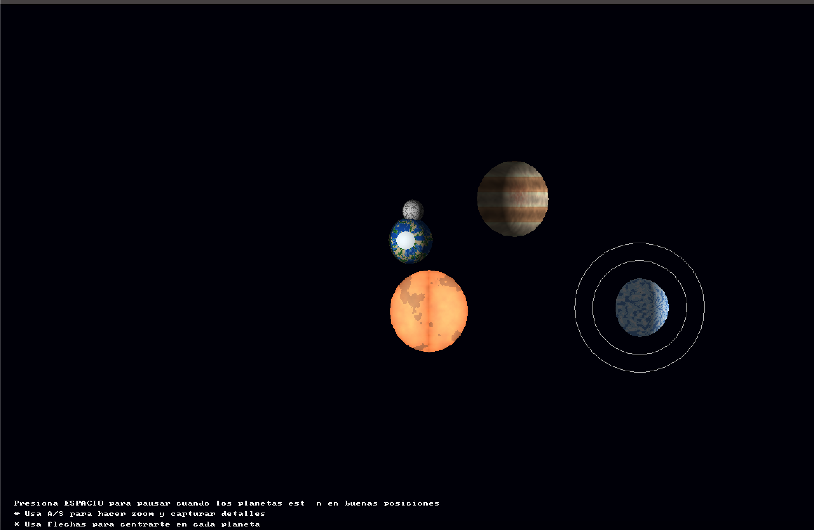

# 🪐 Laboratorio 5 - Sistema Solar en Rust
Laboratorio 5 – Computación Gráfica

Autor: Marinés García
Lenguaje: Rust
Librerías principales: minifb, nalgebra_glm

## 🌍 Descripción del proyecto

Este proyecto implementa un sistema solar 3D simplificado utilizando renderizado por software en Rust.
El programa genera cuerpos celestes (Sol, planetas y lunas) usando modelos .obj sin texturas, aplicando rotación, traslación y sombreado básico simulado con shaders personalizados.

El objetivo del laboratorio es demostrar:

- Transformaciones geométricas (traslación, rotación, escala).
- Pipeline gráfico implementado desde cero.
- Efectos visuales personalizados con shaders.
- Control interactivo de cámara y zoom.

## 🚀 Características principales

✅ Renderizado en tiempo real usando framebuffer

Sistema solar con:

☀️ Estrella (Sol)

🌍 Planeta rocoso con 🌕 Luna

🪐 Planeta helado con anillos

🪐 Planeta gigante

✅ Movimiento orbital y rotacional independiente
✅ Control de cámara y zoom interactivo
✅ Modo pausa y centrado automático

## 🕹️ Controles
- Tecla	Acción
- ↑ ↓ ← →	Mover la cámara
- A / S	Zoom in / out
- ESPACIO	Pausar / Reanudar movimiento
- R	Recentrar cámara
- H	Mostrar / Ocultar ayuda
- ESC	Salir del programa

## 🧠 Estructura del proyecto
```
Lab5/
│
├── assets/
│   └── models/
│       ├── sphere.obj        # Modelo base para planetas y luna
│       └── Lab5.mtl          # Archivo auxiliar (no se usa)
│
├── src/
│   ├── main.rs               # Programa principal (render y lógica)
│   ├── framebuffer.rs        # Framebuffer: buffer de píxeles
│   ├── vertex.rs             # Estructura de vértices
│   ├── fragment.rs           # Estructura de fragmentos
│   ├── triangle.rs           # Rasterización de triángulos
│   ├── line.rs               # Dibujo de líneas (para anillos)
│   ├── shader.rs             # Shaders por tipo de planeta
│   ├── shaders.rs            # Vertex shader y utilidades
│   ├── color.rs              # Conversión y manejo de colores
│   └── obj.rs                # Carga de modelos .obj
│
├── Cargo.toml                # Configuración del proyecto y dependencias
└── README.md                 # Este archivo
```

## ⚙️ Dependencias

Asegúrate de tener instalado Rust y cargo:
```bash
rustc --version
cargo --version
```

Instala las dependencias automáticamente con:
```bash
cargo build --release
```

Dependencias principales (Cargo.toml):
```toml
[dependencies]
minifb = "0.25"
nalgebra-glm = "0.18"
```

## ▶️ Ejecución

Para ejecutar el programa:
```bash
cd Lab5/src
cargo run --release
```

## 🧩 Detalles técnicos

El renderizador simula el pipeline gráfico:
- Vertex shader → Ensamblado de triángulos → Rasterización → Fragment shader.
- Cada planeta es un modelo .obj escalado y transformado mediante matrices Mat4 (de nalgebra_glm).
- Los anillos del gigante gaseoso se generan proceduralmente con líneas concéntricas.
- La luna orbita dinámicamente alrededor del planeta rocoso.

## 💡 Posibles mejoras

- Agregar proyección en perspectiva (actualmente 2D).
- Implementar iluminación Phong básica.
- Cargar múltiples modelos .obj para variación de formas.
- Agregar detección de colisiones visuales entre órbitas.

## 📸 Ejemplo visual (preview)



## 📜 Licencia

Este proyecto fue desarrollado con fines académicos.
Puedes modificarlo y distribuirlo libremente con atribución al autor original.